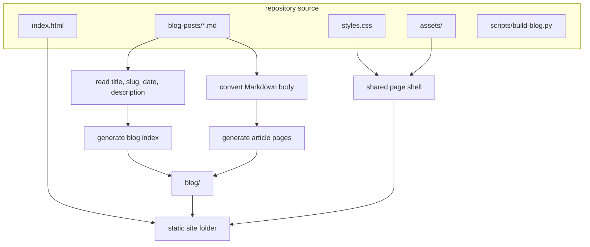
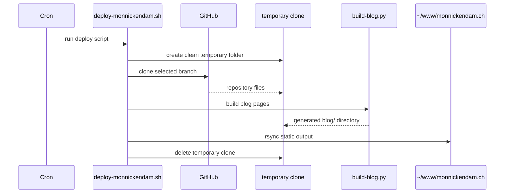
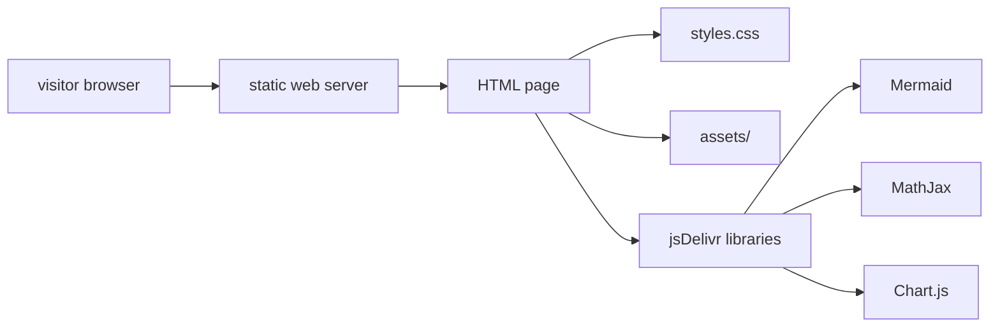

# How This Portfolio Works

I built this website in a way that I can actually keep in my head. That was the main rule. I did not want a portfolio that only made sense while the development server was running, or one that needed a dashboard, a database, and a pile of dependencies just to publish a few pages.

So `monnickendam.ch` is mostly just files. HTML, CSS, a bit of JavaScript, some assets, and generated blog pages. When someone opens the site, the server does not do anything clever. It sends the files over and the browser renders them.

This is not the fanciest way to build a website, but it is a very maintainable way to build this website.

## The Shape Of The Site

The homepage is plain `index.html`. That file is the front door: intro, projects, certifications, experience, contact form, and links. The styling is in `styles.css`, and the font is bundled locally in `assets/fonts/`.

The visual style is intentionally narrow. Off-black, off-white, hard borders, monospace. I like websites that look like they have rules. This one is not trying to look like a startup landing page. It is closer to a document or a small terminal interface.

The contact form is the one part of the homepage that talks to anything outside the site. The code for that lives in `contact.js`, and it sends the form submission to a webhook. The rest of the homepage is static.

## Writing Posts Without A CMS

The blog is the only part that needs a small build step. I do not want to write full HTML every time I publish something, but I also do not want to run a full blogging platform. Markdown is enough.

Every post starts as a file in `blog-posts/`.

Each article starts with a small front matter block:

```markdown
---
title: How This Portfolio Works
slug: how-this-portfolio-works
date: 2026-08-11 23:58
description: How monnickendam.ch is built.
---
```

That little block at the top tells the build script what the post is called, what URL to use, what date to sort it by, and what summary to show on the blog index. After that, it is just the article.

When I run the build script, it reads the Markdown files and writes finished HTML into `blog/`.

```bash
python3 scripts/build-blog.py
```

So this source file:

```text
blog-posts/how-this-portfolio-works.md
```

turns into this published page:

```text
blog/how-this-portfolio-works/index.html
```

The blog index is rebuilt at the same time. It shows newest posts first, but the numbers are based on publication order from oldest to newest. So if an article is `[04]`, it stays `[04]`. New posts do not reshuffle old ones.

## The Build Step

This build script is probably the closest thing the site has to a backend. It runs before the site is deployed. It does not run when someone visits a page.



The Markdown renderer is small on purpose. It supports the things I actually use here: headings, paragraphs, lists, tables, blockquotes, code blocks, math blocks, Mermaid diagrams, and Chart.js graphs.

The more complicated rendering is handed off to proper libraries. Mermaid draws diagrams. MathJax handles math. Chart.js handles graphs. The Python script just prepares the page around them.

## Deployment

Deployment is deliberately plain. The web directory is not special and it does not need to be a Git repository. It is just the folder that receives the built site.

The deploy script is `server-side/deploy-monnickendam.sh`. It can be run manually, but the intended use is cron. It clones the GitHub repo into a temporary directory, builds the blog, and syncs the result into:

```text
~/www/monnickendam.ch
```

The full deploy flow is basically:



I like this because the live folder is disposable. If something goes wrong, there are only a few places to look: the repo, the build script, or the deploy script. There should not be some mystery state on the server that only exists because I clicked something months ago.

## What Happens When Someone Visits

Once the site is deployed, visitors get the boring path:



No Python runs here. The Markdown has already been turned into HTML. The browser gets static files, loads the CSS, and pulls in the few runtime libraries needed for diagrams, math, and charts.

That keeps hosting simple. A basic static web server is enough.

## Why Keep It This Small?

A bigger framework would make some things easier. I am not pretending otherwise. But it would also make the site feel less like mine. For a personal portfolio, I care more about being able to understand the whole thing than having every possible feature ready in advance.

There are tradeoffs. The Markdown parser is small and opinionated. The build script is very specific to this site. If I want a new content feature, I usually have to edit the script. That is fine. The project is narrow enough that those choices are still easy to see.

The entire site mostly lives in a few files:

```text
index.html
styles.css
contact.js
scripts/build-blog.py
server-side/deploy-monnickendam.sh
```

That is the part I like. It is not a platform pretending to be a portfolio. It is just a portfolio with enough machinery to make writing and publishing comfortable.
